# 期末實作 — 412630971 邱秉智

## 1. 架構總覽
<Mermaid 圖 + 一段話說明>
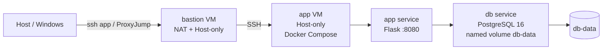
延續期中bastion -> app架構，Host再透過ProxyJump進入app VM。然後在app VM上使用Docker Compose管理Flask app跟PostgreSQL db兩個service，最後資料庫資料透過named volume db-data保存並加入healthcheck、資源限制、log rotation和權限加固設定。
## 2. Part A：底座與基準點
<ssh 證據 + 版本 + snapshot>
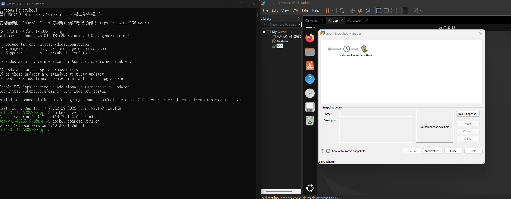

## 3. Part B：Dockerfile 與快取
<Dockerfile + 兩次 build 對照>
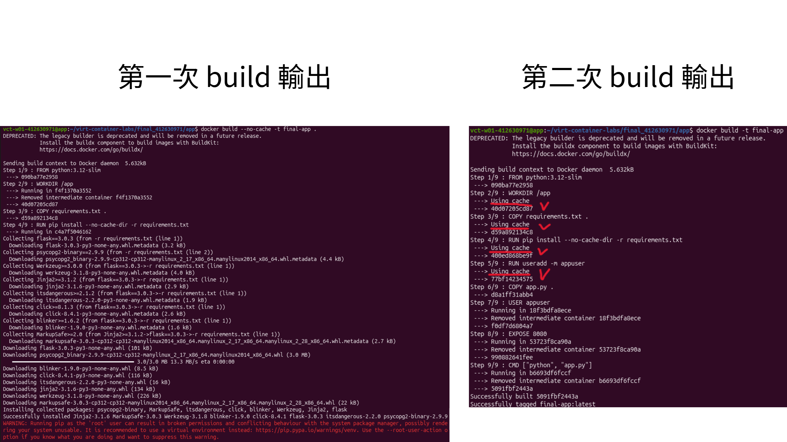
### 為什麼聽 8080 不聽 80？
因為我在Dockerfile建立appuser，然後用USER appuser執行Flask，不是直接用root執行
Linux的80 Port算特權埠，需要root權限才能用。且我以比較安全的方式運行，所以改用一般使用者可使用的8080 Port
可以避免應用程式有過高權限，也符合最小權限原則。所以這次的Flask服務監聽8080而不是80

## 4. Part C：Compose 與資料持久化
<compose.yaml 重點 + 三段對照>

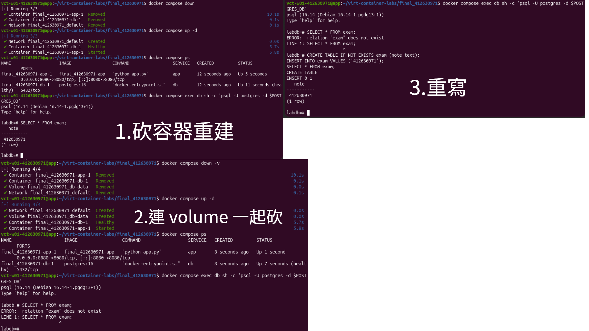
### down vs down -v
必答：down 跟 down -v 差在哪？named volume 的生命週期跟著誰？
A:down會直接停止然後刪除container和network，但不會刪除named volume，所以資料庫的資料還會保留下來。
down -v 則會把named volume一起刪除，所以重新啟動後會得到全新的資料庫，原本的資料表和資料都會消失。
named volume的生命週期不是跟container，而是獨立的。就算container被刪除重建但只要volume還在，資料就會保留。只有刪除volume時資料才會消失。

## 5. Part D：生產化加固
<權限驗證輸出 + cgroup 讀值對照表>
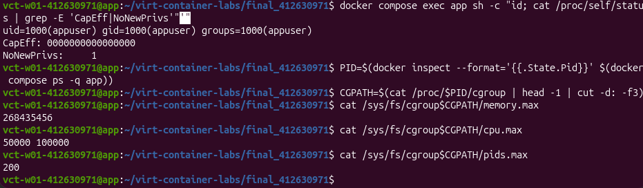

### yaml 的值怎麼對回 cgroup 檔案？(必答：268435456 跟 50000 100000 各自怎麼對回你 yaml 裡寫的值？)
A:memory.max顯示268435456，代表256×1024×1024Bytes，所以對應compose.yaml的mem_limit:256m。
cpu.max顯示50000 100000，代表在每100000微秒的週期內最多可使用50000微秒的CPU時間，也就是可使用50% CPU，所以對應compose.yaml中的cpus:"0.5"。

## 6. Part E：故障演練
### 故障 1：F1
- 注入方式：docker compose stop db
- 故障前：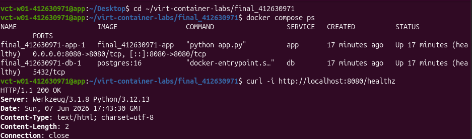
- 故障中：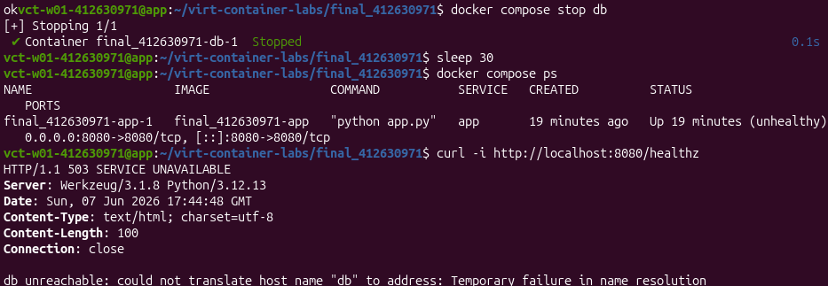
- 回復後：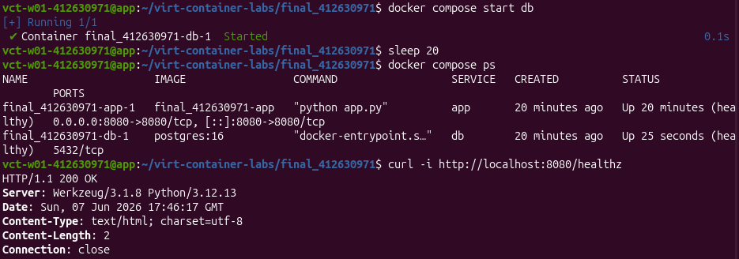
- 診斷推論：因為app本身仍在運作，但因為無法連線到資料庫，所以健康檢查失敗然後回傳503。所以應用程式正常，但後端服務發生問題。

### 故障 2：F2
- 注入方式：docker compose stop app
- 故障前：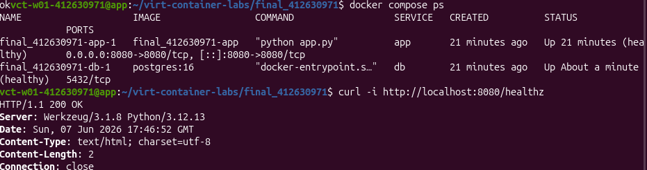
- 故障中：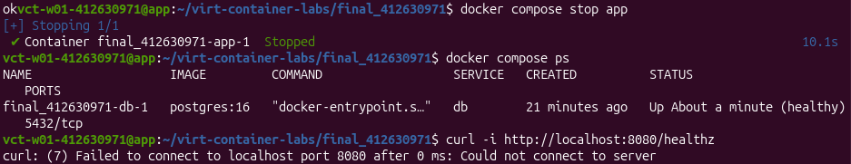
- 回復後：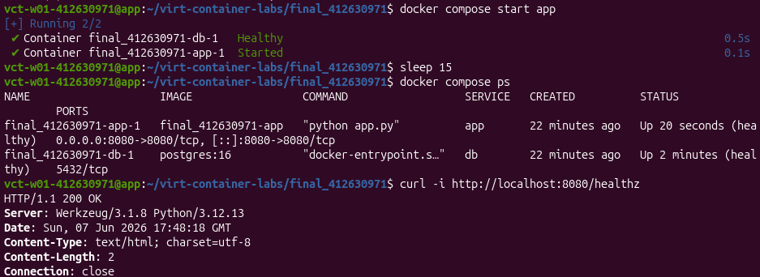
- 診斷推論：因為app容器已停止，主機上沒有程式監聽8080 Port，所以才產生connection refused。

### 三症狀分層表（必答）
| 症狀 | 最可能的層 | 第一條驗證命令 |
| ---- | ---------- | -------------- |
| timeout | 網路層或防火牆層 | curl -v http://目標位址 |
| connection refused | docker compose ps | docker compose ps |
| HTTP 503 | 應用程式依賴服務層 | docker compose logs app |

## 7. 反思（200 字）
這學期從 VM 做到 production-ready 容器，「隔離」這個概念在 VM、namespace、
cgroup、權限階梯四個地方各出現一次——它們在防的東西一樣嗎？

A:我這學期從VM一路做到production-ready容器後，我對(隔離)有更具體的理解了。
雖然VM、namespace、cgroup和權限階梯都和隔離有關，但是他們要保護的對象都不一樣。
VM是把整個系統都隔離開來，來避免不同的環境去互相影響。
namespace則是讓容器有自己獨立的程序、網路與檔案系統視角。
cgroup則是負責限制CPU和記憶體等資源的使用量，來避免單一容器耗盡系統的資源。
權限階梯則是透過非root使用者、cap_drop和no-new-privileges等設定來降低安全風險。
透過這次的實作，我發現容器不單單只是把程式包起來執行而已，而是會透過多層的機制來同時兼顧隔離、安全和穩定性。像是在part D中，我實際操作驗證到了資源限制是不是真的寫進cgroup，也觀察到權限降低後仍能正常運作。
從VM到Docker的過程中，讓我更加了解到現代服務部屬的方式，也更加理解為何在正式環境中需要一邊考量效能、可靠性和安全性，而不只是單單可以執行程式而已。

## 8. Bonus（選做）
### Bonus 2｜Namespace 取證

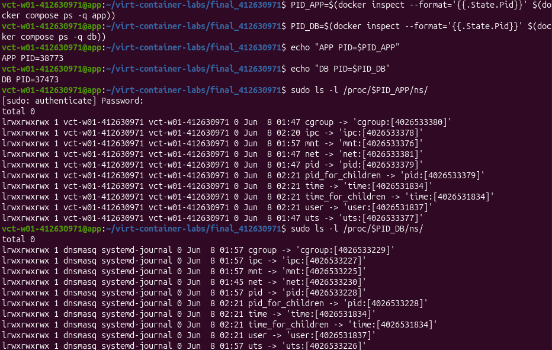

從截圖可以看到app和db的namespace編號不同:
| namespace | app | db | 結果 |
|---|---:|---:|---|
| pid | 4026533379 | 4026533228 | 不同 |
| net | 4026533381 | 4026533230 | 不同 |
| mnt | 4026533376 | 4026533225 | 不同 |
app和db雖然都跑在同一台VM上，但它們的程序空間、網路空間和掛載空間都是分開的。跟「容器不是輕量VM」的關係:他們不是各自都有一個完整作業系統，而是共用host的Linux kernel再透過namespace隔離。
