# 期中實作 — 412630971 邱秉智

## 1. 架構與 IP 表
## Mermaid

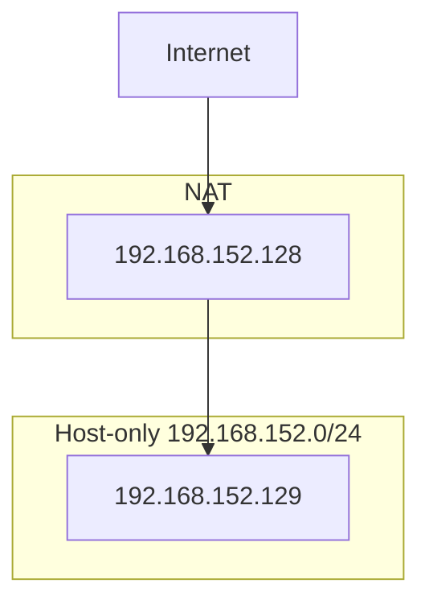
## IP表
| VM | 網卡 | 模式 | IP | 用途 |
|---|---|---|---|---|
| bastion | NIC 1 | NAT | 192.168.168.130 | 上網 |
| bastion | NIC 2 | Host-only | 192.168.152.128 | 內網 |
| app | NIC 1 | Host-only | 192.168.152.129 | 內網 |


## 2. Part A：VM 與網路

### IP 確認

#### bastion

命令：
```bash
ip -4 addr
```

關鍵輸出：
```bash
inet 192.168.168.130/24   # NAT
inet 192.168.152.128/24   # Host-only
```

連線測試（bastion → app）

命令：
```bash
ping -c 2 192.168.152.129
```

輸出：
```bash
2 packets transmitted, 2 received, 0% packet loss
```

---

#### app

命令：
```bash
ip -4 addr
```

關鍵輸出：
```bash
inet 192.168.152.129/24   # Host-only
```

連線測試（app → bastion）

命令：
```bash
ping -c 2 192.168.152.128
```

輸出：
```bash
2 packets transmitted, 2 received, 0% packet loss
```

## 3. Part B：金鑰、ufw、ProxyJump
### 防火牆規則表

| 主機 | 規則 |
|------|------|
| bastion | default deny incoming |
| bastion | allow 22/tcp |
| app | default deny incoming |
| app | allow from 192.168.152.128 to any port 22 proto tcp |

---

### ProxyJump 成功證據

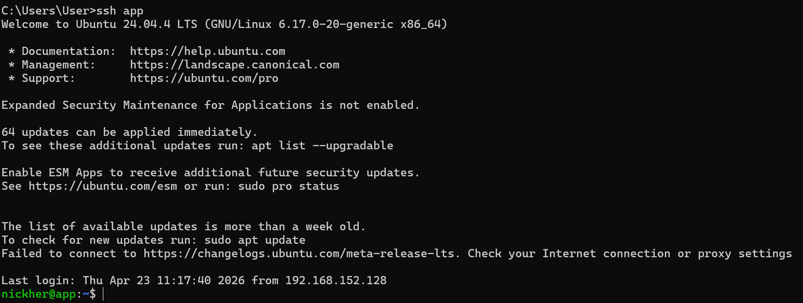

## 4. Part C：Docker 服務
### Docker 運行狀態
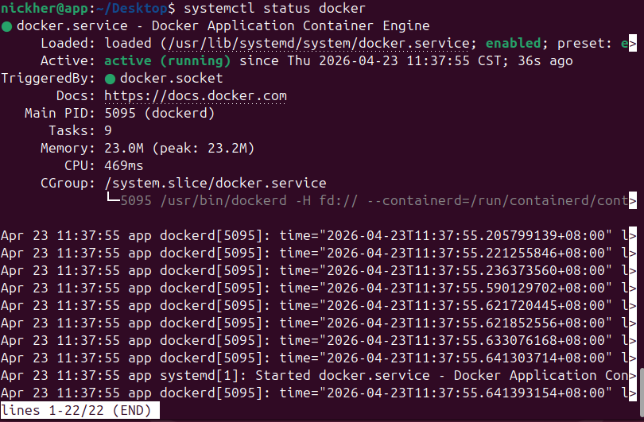

### nginx 服務測試（HTTP 200）
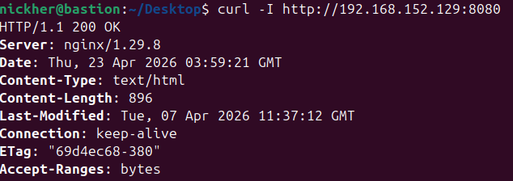

## 5. Part D：故障演練
### 故障 1：<F1>
- 注入方式：sudo ip link set ens33 down
- 故障前：
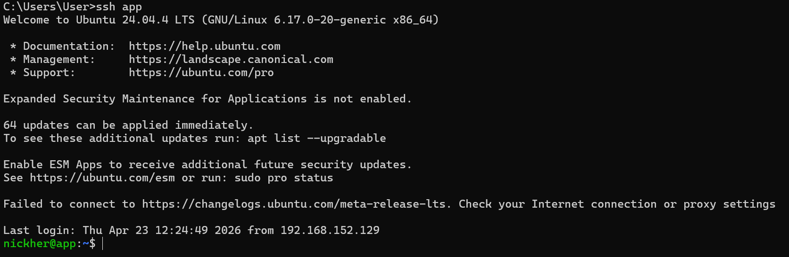

- 故障中：
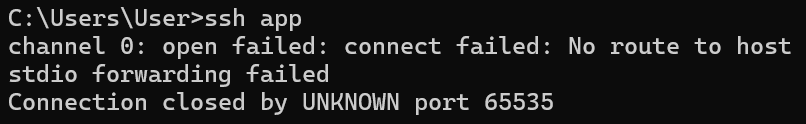

- 回復後：
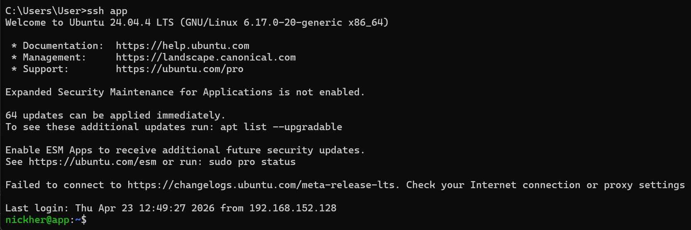

- 診斷推論：
關閉ens33（Host-only）後，ssh app 出現 timeout / no route，表示 Host 無法透過內網連到 app，判斷為網路層（L2/L3）問題。

### 故障 2：<F3>
- 注入方式：
sudo systemctl stop docker
sudo systemctl stop docker.socket

- 故障前：
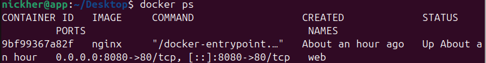

- 故障中：
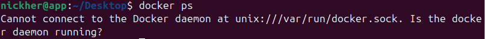

- 回復後：
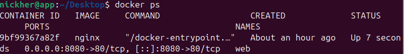

- 診斷推論：
在故障中ssh app 仍可正常連線，但docker ps顯示
Cannot connect to the Docker daemon，表示網路層正常，
問題發生在服務層Docker daemon 被停止。

### 症狀辨識（若選 F1+F2 必答）我選F1+F3

當發生問題時，可以先用SSH來判斷。如果連ssh app都連不上（timeout 或 no route to host），代表是網路層問題（F1），但如果ssh仍然可以正常連線，只是docker指令無法使用，顯示Cannot connect to the Docker daemon，則代表是服務層問題（F3）。透過這種方式，可以快速判斷問題是在網路還是服務，而不需要一開始就做太多測試。

## 6. 反思（200 字）
這次做完，對「分層隔離」或「timeout 不等於壞了」的理解有什麼改變？

A:這次實際操作讓我比較有感的是「問題要分不同層看」。以前只要連不上就會覺得整台壞掉，但這次做完發現其實不一定。像F1時，網卡關掉連SSH都會timeout，這就是網路層的問題，但F3把Docker關掉時，SSH 還是可以連，只是 docker指令不能用，代表只是服務壞掉而已。這讓我學到，遇到問題不能只看表面，要先判斷是網路、服務還是其他層出問題。另外像timeout這種狀況，也不代表整個系統壞掉，有可能只是某一段被擋住，像是網路不通或服務沒有開。這次練習讓我比較有系統地去排錯，不會像以前一樣亂試，也會先用一些指令去確認問題在哪一層，感覺在實際工作上也會很有用。

## 7. Bonus（選做）
## Bonus 1：Dockerfile 優化

### Dockerfile
```dockerfile
FROM nginx:alpine
COPY index.html /usr/share/nginx/html/index.html
EXPOSE 80
```
```.dockerignore
.git
node_modules
*.log
```
docker history:
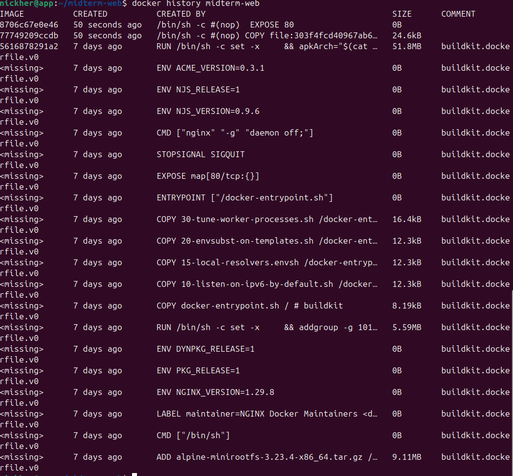
從 bastion curl http://<APP>:8081 看到學號的證據


### 每一層說明

從 docker history 可以看到 image 是一層一層組成的。

最上面的 **EXPOSE 80** 跟 **COPY index.html** 是我這次Dockerfile加上去的，其中COPY是把我自己的首頁放進container裡面。
下面一堆<missing>則是nginx:alpine本身就有的內容，
像是安裝nginx、設定環境等等，所以不是我自己做的。
所以可以很清楚看出哪些是我新增的layer，哪些是base image原本就有的。

為什麼 COPY 要放在 FROM 後面（快取考量）

因為Docker build是由上到下一層一層建立的，必須先有FROM才會有base image，後面才能把檔案COPY進去。
而且Docker會用快取機制，如果index.html沒改的話前面的layer像nginx就不用重新下載或重建。
只有當index.html改變時才會重新build COPY這一層，這樣可以讓build速度變快也比較有效率。

## Bonus 2：Cgroup 限制觀察
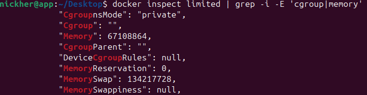

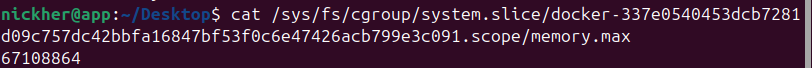
