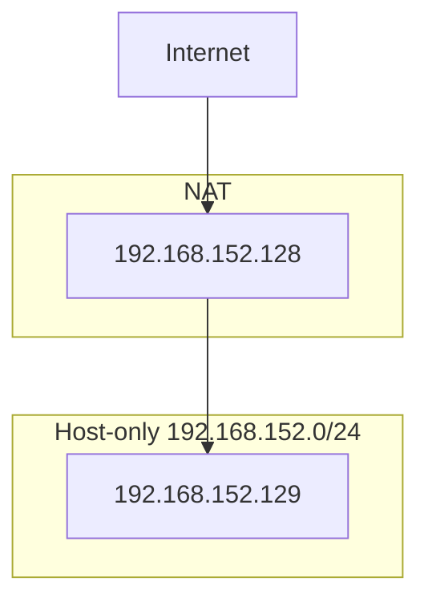

# 期中實作 — 412630971 邱秉智

## 1. 架構與 IP 表
## Mermaid


## IP表
| VM | 網卡 | 模式 | IP | 用途 |
|---|---|---|---|---|
| bastion | NIC 1 | NAT | 192.168.168.130 | 上網 |
| bastion | NIC 2 | Host-only | 192.168.152.128 | 內網 |
| app | NIC 1 | Host-only | 192.168.152.129 | 內網 |


## 2. Part A：VM 與網路

### IP 確認

#### bastion

命令：
```bash
ip -4 addr
```

關鍵輸出：
```bash
inet 192.168.168.130/24   # NAT
inet 192.168.152.128/24   # Host-only
```

連線測試（bastion → app）

命令：
```bash
ping -c 2 192.168.152.129
```

輸出：
```bash
2 packets transmitted, 2 received, 0% packet loss
```

---

#### app

命令：
```bash
ip -4 addr
```

關鍵輸出：
```bash
inet 192.168.152.129/24   # Host-only
```

連線測試（app → bastion）

命令：
```bash
ping -c 2 192.168.152.128
```

輸出：
```bash
2 packets transmitted, 2 received, 0% packet loss
```

## 3. Part B：金鑰、ufw、ProxyJump
### 防火牆規則表

| 主機 | 規則 |
|------|------|
| bastion | default deny incoming |
| bastion | allow 22/tcp |
| app | default deny incoming |
| app | allow from 192.168.152.128 to any port 22 proto tcp |

---

### ProxyJump 成功證據


## 4. Part C：Docker 服務
### Docker 運行狀態


### nginx 服務測試（HTTP 200）


## 5. Part D：故障演練
### 故障 1：<F1>
- 注入方式：sudo ip link set ens33 down
- 故障前：


- 故障中：


- 回復後：


- 診斷推論：
關閉ens33（Host-only）後，ssh app 出現 timeout / no route，表示 Host 無法透過內網連到 app，判斷為網路層（L2/L3）問題。

### 故障 2：<F3>
- 注入方式：
- 故障前：
- 故障中：
- 回復後：
- 診斷推論：

### 症狀辨識（若選 F1+F2 必答）
兩個都 timeout，我怎麼分？

## 6. 反思（200 字）
這次做完，對「分層隔離」或「timeout 不等於壞了」的理解有什麼改變？

## 7. Bonus（選做）
