# W01｜虛擬化概論、環境建置與 Snapshot 機制
## 環境資訊
- Host OS：Windows 11
- VM 名稱：vct-w01-412630971
- Ubuntu 版本：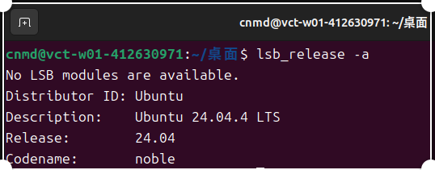

- Docker 版本：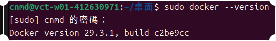

- Docker Compose 版本：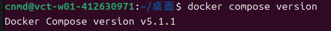
## VM 資源配置驗證
| 項目 | VMware 設定值 | VM 內命令 | VM 內輸出 |
|---|---|---|---|
| CPU | 2 vCPU | `lscpu \| grep "^CPU(s)"` | CPU(s): 2 |
| 記憶體 | 4 GB | `free -h \| grep Mem` | Mem: 3.8Gi 1.5Gi 288Mi 36Mi 2.3Gi 2.2Gi |
| 磁碟 | 40 GB | `df -h /` | /dev/sda2 40G 12G 26G 30% / |
| Hypervisor | VMware | `lscpu \| grep Hypervisor` | Hypervisor vendor: VMware |
## 四層驗收證據
- [x] ① Repository：`cat /etc/apt/sources.list.d/docker.list` 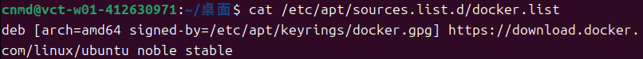

- [x] ② Engine：`dpkg -l | grep docker-ce` 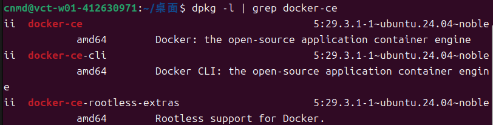

- [x] ③ Daemon：`sudo systemctl status docker` 顯示 active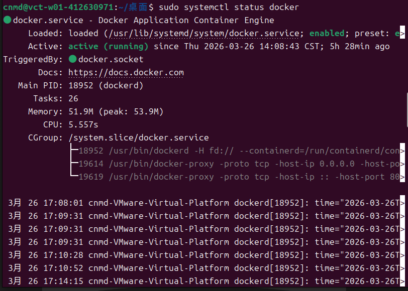

- [x] ④ 端到端：`sudo docker run hello-world` 成功輸出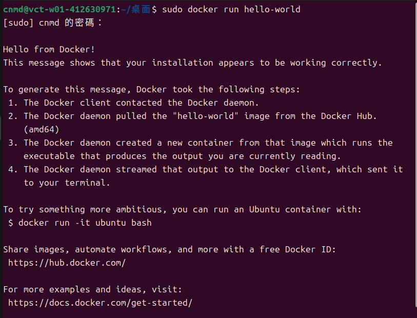

- [x] Compose：`docker compose version` 可執行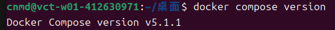
## 容器操作紀錄
- [x] nginx：`sudo docker run -d -p 8080:80 nginx` + `curl localhost:8080` 輸出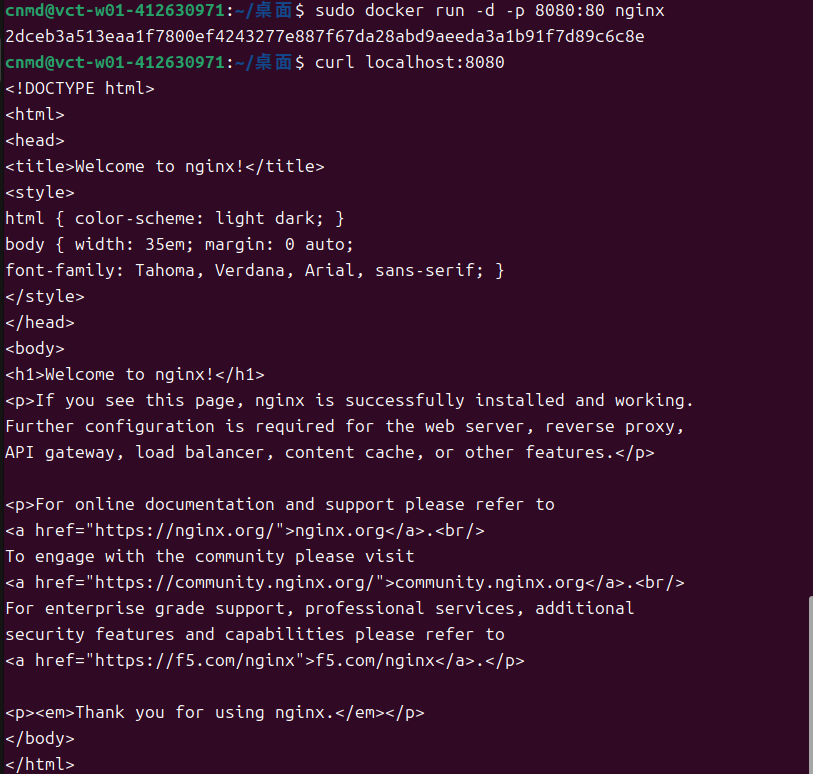

- [x] alpine：`sudo docker run -it --rm alpine /bin/sh` 內部命令與輸出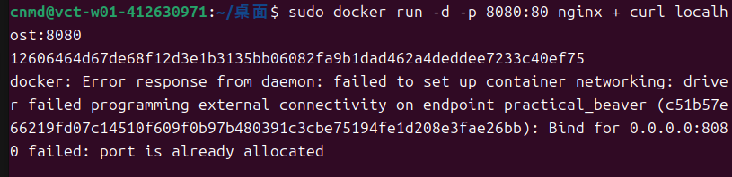

- [x] 映像列表：`sudo docker images` 輸出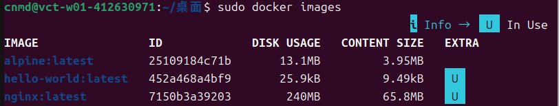
## Snapshot 清單

| 名稱 | 建立時機 | 用途說明 | 建立前驗證 |
|---|---|---|---|
| clean-baseline | Ubuntu安裝完成後 | 這個時間點是剛安裝好系統，還沒裝docker，是最乾淨的開始狀態，之後環境出問題的話可以回到這裡重新開始 | 先確認系統可以正常開機，然後網路正常，而且apt update也可以正常執行 |
| docker-ready | 完成Docker與Docker Compose安裝後 | 如果Docker壞掉可以直接回到這裡，不用重裝 | 確認docker --version 和docker compose version都正常，docker run hello-world可以成功，nginx也能啟動並用curl測試成功 |
## 故障演練三階段對照

| 項目 | 故障前（基線） | 故障中（注入後） | 回復後 |
|---|---|---|---|
| docker.list 存在 | 是 | 否 | 是 |
| apt-cache policy 有候選版本 | 是 | 否 | 是 |
| docker 重裝可行 | 是 | 否 | 是 |
| hello-world 成功 | 是 | N/A | 是 |
| nginx curl 成功 | 是 | N/A | 是 |

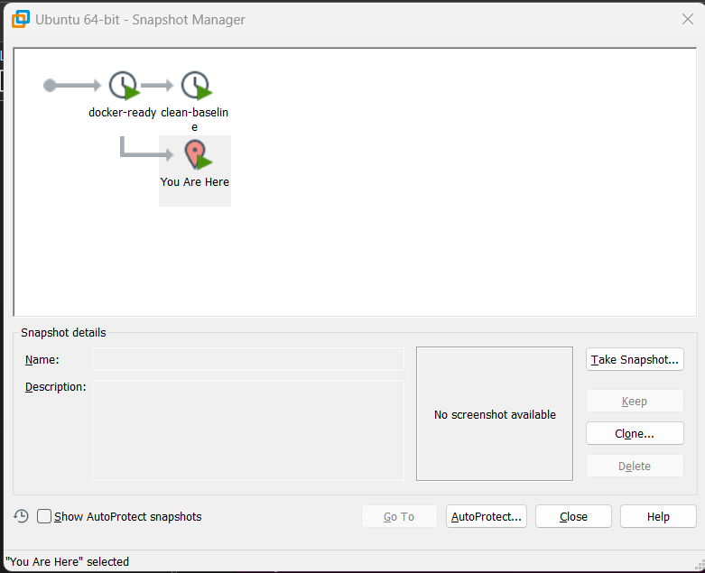

## 手動修復 vs Snapshot 回復

| 面向 | 手動修復 | Snapshot 回復 |
|---|---|---|
| 所需時間 | 5～10分鐘 | 1～2分鐘 |
| 適用情境 | 小問題or想了解錯誤原因時 | 系統出現嚴重問題或需要快速回到穩定狀態時 |
| 風險 | 如果有步驟錯誤，可能變更複雜 | 若 snapshot本身有問題，回復後仍可能出錯 |
## Snapshot 保留策略
- 新增條件：進行重大修改前
- 保留上限：3個
- 刪除條件：舊的snapshot沒有用時
## 最小可重現命令鏈
ls /etc/apt/sources.list.d/
apt-cache policy docker-ce | head -5
sudo systemctl status docker --no-pager
sudo docker run --rm hello-world
sudo docker images

## 排錯紀錄
- 症狀：ssh 連線 app 出現 timeout
- 診斷：先用 ping 測試連線，再用 ip addr 確認網卡狀態，發現是網路介面問題
- 修正：重新啟用網卡或修正網路設定
- 驗證：重新 ssh 可以成功登入，連線正常

## 設計決策
我在VM中安裝Docker，而不是直接在Host OS上使用 Docker。
因為VM可以提供一致的Linux環境，避免Windows或macOS環境差異，
且可透過snapshot快速回復，降低失敗的風險。
