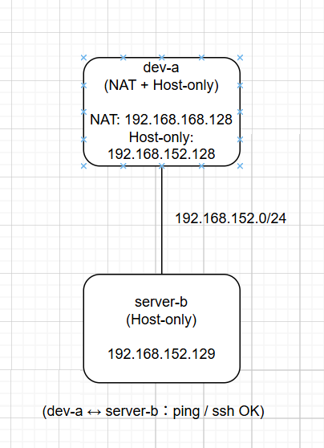

# W02｜VMware 網路模式與雙 VM 排錯

## 網路配置

| VM | 網卡 | 模式 | IP | 用途 |
|---|---|---|---|---|
| dev-a | NIC 1 | NAT | 192.168.168.128 | 上網 |
| dev-a | NIC 2 | Host-only | 192.168.152.128 | 內網互連 |
| server-b | NIC 1 | Host-only | 192.168.152.129 | 內網互連 |

## 連線驗證紀錄

- [x] dev-a NAT 可上網：`ping google.com` 輸出

- [x] 雙向互 ping 成功：貼上雙方 `ping` 輸出

- [x] SSH 連線成功：`ssh <user>@<ip> "hostname"` 輸出

- [x] SCP 傳檔成功：`cat /tmp/test-from-dev.txt` 在 server-b 上的輸出

- [x] server-b 不能上網：`ping 8.8.8.8` 失敗輸出

## 故障演練一：介面停用

| 項目 | 故障前 | 故障中 | 回復後 |
|---|---|---|---|
| server-b 介面狀態 | UP | DOWN | UP |
| dev-a ping server-b | 成功 | 失敗 | 成功 |
| dev-a SSH server-b | 成功 | 失敗 | 成功 |

## 故障演練二：SSH 服務停止

| 項目 | 故障前 | 故障中 | 回復後 |
|---|---|---|---|
| ss -tlnp grep :22 | 有監聽 | 無監聽 | 有監聽 |
| dev-a ping server-b | 成功 | 成功 | 成功  |
| dev-a SSH server-b | 成功 | Connection refused | 成功 |

## 排錯順序

L2:
用ip address show檢查網卡是否為UP和確認是否有IP

L3:
用ip route show檢查路由設定
用ping測試兩台主機是否可連

L4:
用ss -tlnp | grep :22檢查SSH服務是否監聽
用ssh指令測試是否可連線

## 網路拓樸圖

## 排錯紀錄
- 症狀：有時候SSH連不上，ping對方會失敗
- 診斷：我先用ip address show看網卡有沒有開
再用ping測試兩台電腦有沒有連通
如果ping問題，就用ss -tlnp確認SSH有沒有監聽
- 修正：如果發現網卡是DOWN，就用ip link set <介面> up把它打開
如果是SSH沒開，就用systemctl start ssh重新啟動
- 驗證：修好之後再用ping 測一次網路
最後再用ssh連線，看能不能正常連上

## 設計決策

這次我是讓dev-a用NAT加Host-only，server-b只用Host-only。

dev-a用NAT是因為需要上網（安裝東西or更新），
Host-only是讓兩台VM可以在同一個內部網路互相連線。
server-b不用NAT，是因為想把它當成一台內部用的伺服器，
讓它不能直接上網，這樣環境比較單純，也比較好測試網路狀況。
