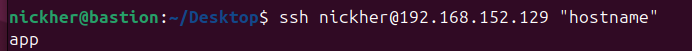
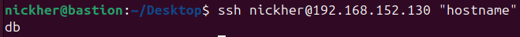
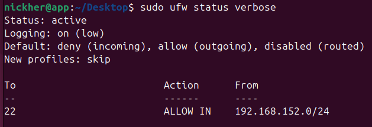
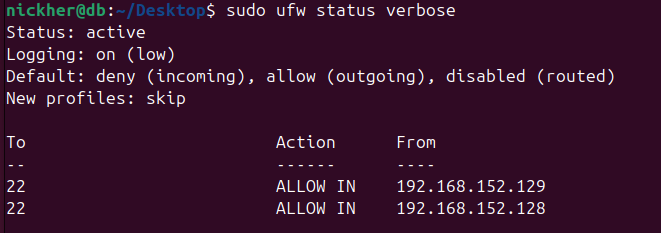
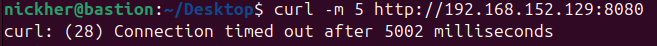
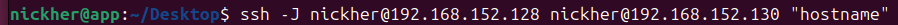
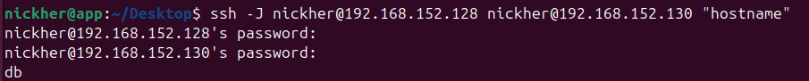
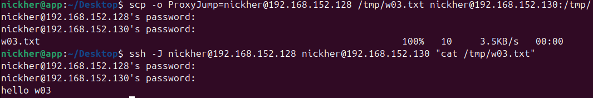
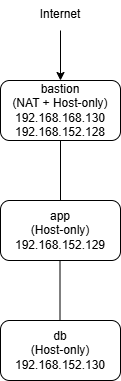

# W03｜多 VM 架構：分層管理與最小暴露設計

## 網路配置

| VM | 角色 | 網卡 | 模式 | IP | 開放埠與來源 |
|---|---|---|---|---|---|
| bastion | 跳板機 | NIC 1 | NAT | 192.168.168.130 | SSH from any |
| bastion | 跳板機 | NIC 2 | Host-only | 192.168.152.128 | — |
| app | 應用層 | NIC 1 | Host-only | 192.168.152.129 | SSH from 192.168.152.0/24 |
| db | 資料層 | NIC 1 | Host-only | 192.168.152.130 | SSH from app + bastion |

## SSH 金鑰認證

- 金鑰類型：ed25519
- 公鑰部署到：app 和 db 的 ~/.ssh/authorized_keys
- 免密碼登入驗證：
  - bastion → app：

  - bastion → db：

## 防火牆規則

### app 的 ufw status

### db 的 ufw status

### 防火牆確實在擋的證據

## ProxyJump 跳板連線
- 指令：

- 驗證輸出：

- SCP 傳檔驗證：

## 故障場景一：防火牆全封鎖

| 項目 | 故障前 | 故障中 | 回復後 |
|---|---|---|---|
| app ufw status | active + rules | deny all | allow 22 |
| bastion ping app | 成功 | 失敗 | 成功 |
| bastion SSH app | 成功 | **timed out** | 成功 |

## 故障場景二：SSH 服務停止

| 項目 | 故障前 | 故障中 | 回復後 |
|---|---|---|---|
| ss -tlnp grep :22 | 有監聽 | 無監聽 | 有監聽 |
| bastion ping app | 成功 | 成功 | 成功 |
| bastion SSH app | 成功 | **refused** | 成功 |

## timeout vs refused 差異
timeout 是連線送出去後，但是對方沒有回應，可能是被防火牆擋住了或是網路不通。
refused 是已經連到對方的主機，但是port沒有開啟服務，Ex.SSH沒有啟動。

## 網路拓樸圖

## 排錯紀錄
- 症狀：一開始SSH連不到，而且會出現 timed out or connection refused。
- 診斷：一開始我先ping看兩台有沒有通確認網路正常。
再用ss -tlnp | grep :22檢查SSH有沒有監聽。
也用ufw status看防火牆規則。
- 修正：如果是防火牆問題，就開放port 22
如果是SSH沒開，就用systemctl start ssh啟動服務。

- 驗證：重新用ping測試連線
再用ssh登入確認可以正常連線

## 設計決策
我是用bastion當中間跳板，app跟db都放在內網裡面
bastion有NAT所以可以連外也可以當入口去連其他機器
app跟db只用Host-only，就是不讓它們直接上網，比較安全一點

db讓bastion可以直接連，是因為管理起來比較方便，
不然每次都要先進app再跳一次，有點麻煩

重點就是讓外面的人不能直接碰到內部
一定要先進bastion才能往裡面走，安全性會比較高。
